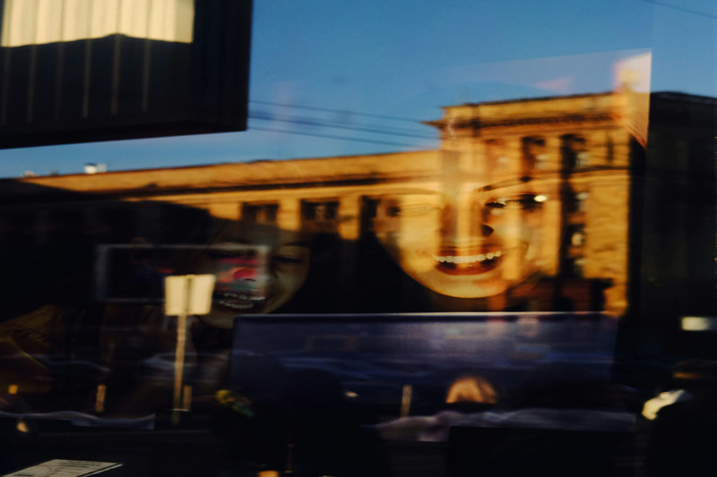
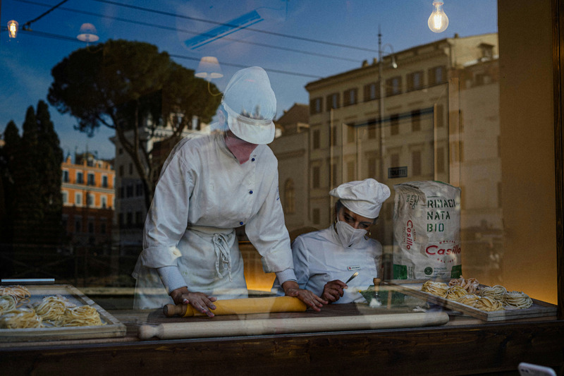
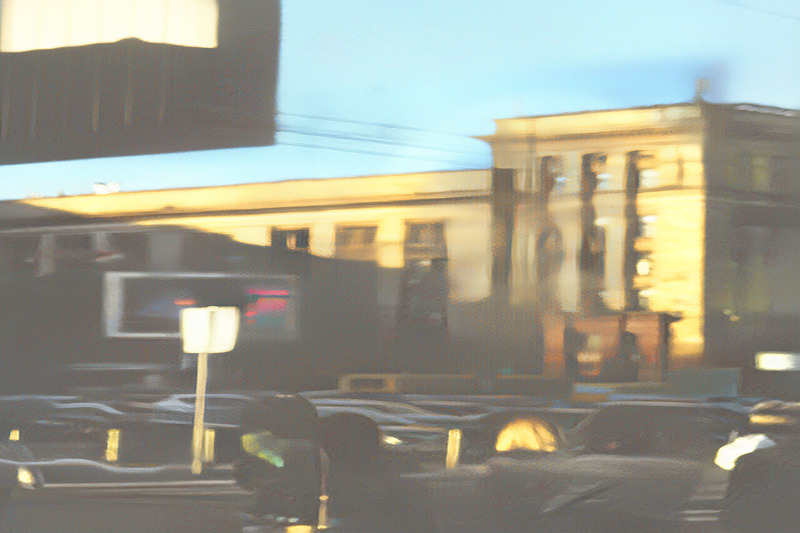
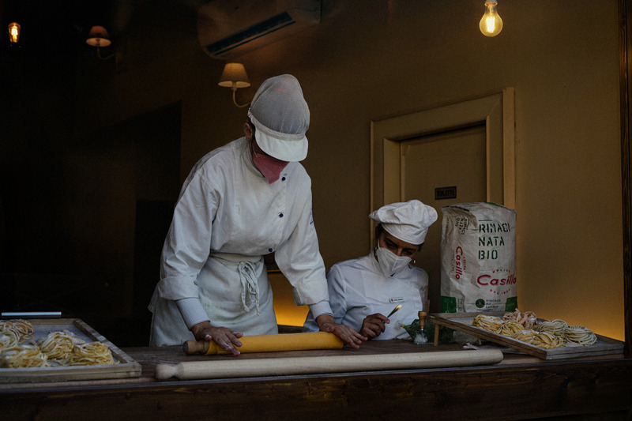
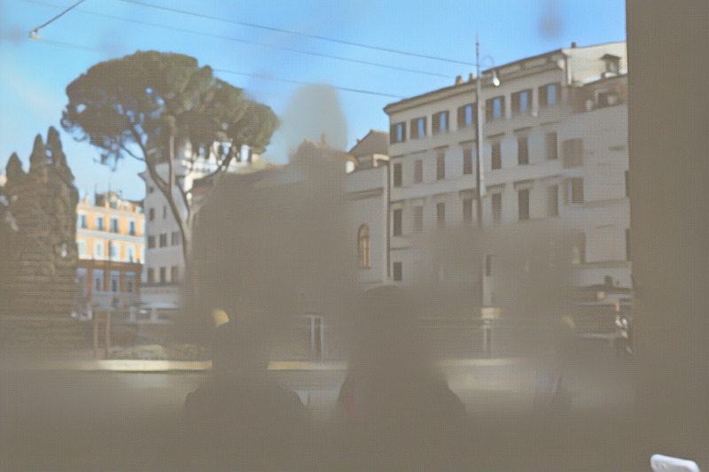

<!-- ═══════════════════════════════════════════════════
     HERO: DAI vs PRISM comparison (JuxtaposeJS)
     ═══════════════════════════════════════════════════ -->

  <!-- Thumbnail selector -->
  

    
    
    
  

  <!-- Single Juxtapose container (rebuilt on thumbnail click) -->
  

    

  

  

    Drag the slider to compare <strong>DAI</strong> (left) vs <strong>PRISM (Ours)</strong> (right) on challenging in-the-wild images.
     Click thumbnails above to switch images.
  

<!-- Input → Transmission + Reflection triplets -->

  <h3 style="text-align:center; margin-bottom:1rem;">PRISM decomposes each image into transmission and reflection</h3>
  

    

Input

    

Transmission

    

Reflection

  

  

    

Input

    

Transmission

    

Reflection

  

  

    

Input

    

Transmission

    

Reflection

  

---

<!-- ═══════════════════════════════════════════════════
     ABSTRACT
     ═══════════════════════════════════════════════════ -->

    

        <h2>Abstract</h2>
        

Single-image reflection removal (SIRR) seeks to recover the transmission layer from a mixture corrupted by reflections — a severely ill-posed problem. Existing methods operate in pixel space, where the nonlinear sRGB formation model entangles the two layers and limits generalization. We observe that pretrained VAE latent spaces exhibit substantially lower coherence between image layers compared to pixel space, providing a more favorable working space for decomposition. Building on this finding, we propose <strong>PRISM</strong> (<em>Pretrained-latent Reflection Image Separation Model</em>), which reinterprets SIRR as a latent linear separation problem. Under an approximate additive formulation in latent space, PRISM learns a flow matching velocity field on a pretrained FLUX backbone that recovers both transmission and reflection in a single forward pass. To enforce robust disentanglement, we introduce a <strong>Latent Composition Consistency (LCC)</strong> strategy that constructs synthetic mixtures by swapping reflection latents across samples and enforces consistent decomposition via a cycle loss. We further propose a <strong>Layer Contrastive Separation (LCS)</strong> loss that promotes semantic separation between layers through patch-level contrastive learning, without requiring explicit reflection targets. Experiments on six benchmarks demonstrate that PRISM consistently outperforms state-of-the-art methods by significant margins, with strong generalization to in-the-wild images.
        

    

---

## Key Idea

  

    

      
    

  

  

    

      
Why Latent Space?

      In pixel space, transmission and reflection are highly entangled (avg. cos = <strong>0.74</strong>). In <strong>FLUX VAE latent space</strong>, this drops to <strong>0.07</strong> — broad decorrelation that makes linear separation feasible.
    

  

---

## Method

  

  

    
Latent Composition Consistency (LCC)

    
Constructs synthetic mixtures by <em>swapping reflection latents</em> across samples and enforces consistent decomposition via a cycle loss.

  

  

    
Layer Contrastive Separation (LCS)

    
Promotes semantic separation between layers through <em>patch-level contrastive learning</em>, without requiring explicit reflection targets.

  

---

## Benchmark Results

### Qualitative Comparison

  

### Reflection Recovery

  

---

## Citation

<button class="copy-btn" onclick="copyBibtex()">
  <i class="fas fa-copy"></i> Copy BibTeX
</button>
<pre><code id="bibtex">@inproceedings{shin2026prism,
    title={PRISM: Latent Composition Consistency for Single-Image Reflection Removal},
    author={Junseong Shin and Tae Hyun Kim},
    booktitle={European Conference on Computer Vision (ECCV)},
    year={2026}
}</code></pre>

