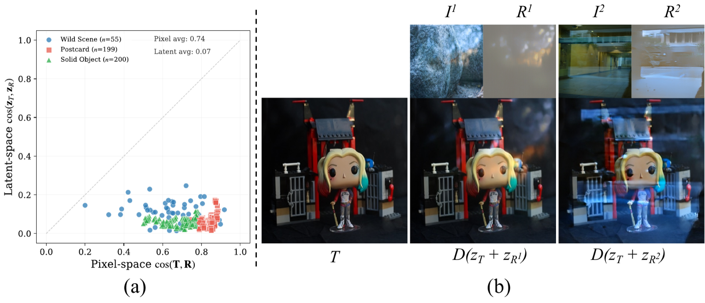
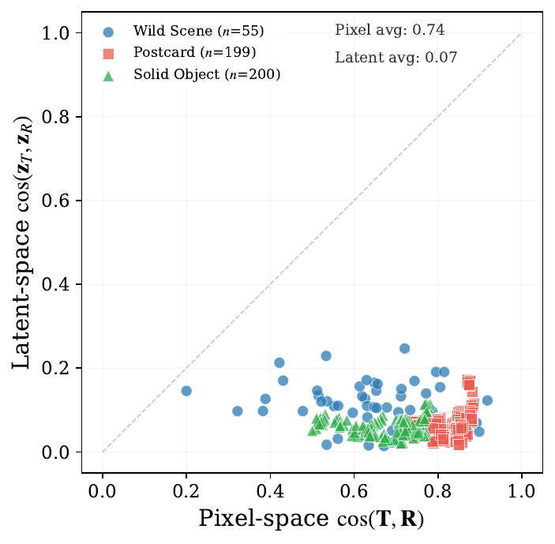
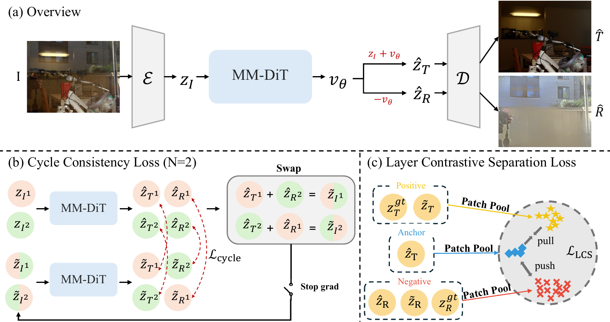
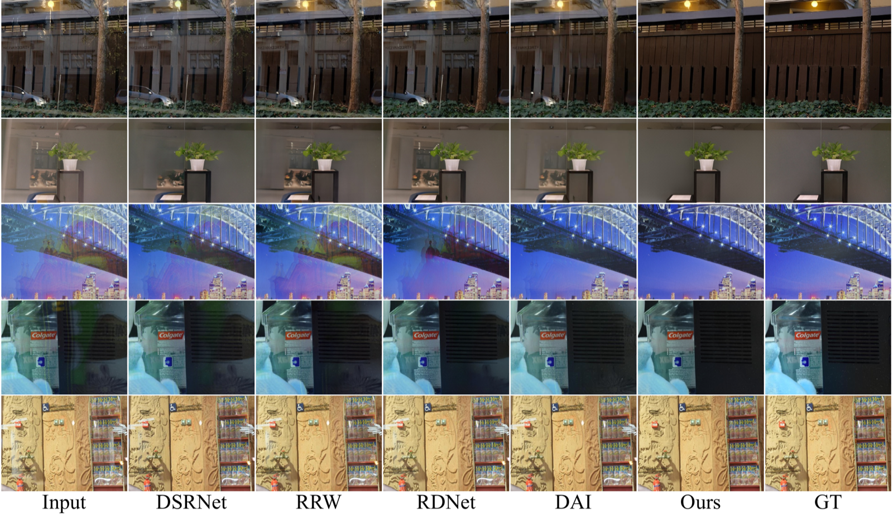
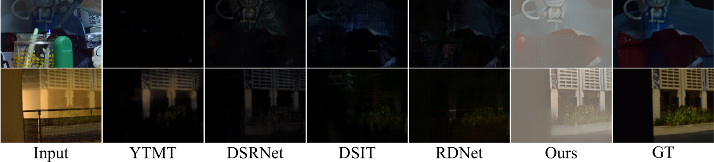

<!-- Using HTML to center the abstract -->
<div class="columns is-centered has-text-centered">
    <div class="column is-four-fifths">
        <h2>Abstract</h2>
        <div class="content has-text-justified">
Single-image reflection removal (SIRR) seeks to recover the transmission layer from a mixture corrupted by reflections — a severely ill-posed problem. Existing methods operate in pixel space, where the nonlinear sRGB formation model entangles the two layers and limits generalization. We observe that pretrained VAE latent spaces naturally project transmission and reflection into nearly orthogonal subspaces, enabling a fundamentally more separable working space. Building on this finding, we propose <strong>PRISM</strong> (<em>Pretrained-latent Reflection Image Separation Model</em>), which reinterprets SIRR as a latent linear separation problem. Under an approximate additive formulation in latent space, PRISM learns a flow matching velocity field on a pretrained FLUX backbone that recovers both transmission and reflection in a single forward pass. To enforce robust disentanglement, we introduce a <strong>Latent Composition Consistency (LCC)</strong> strategy that constructs synthetic mixtures by swapping reflection latents across samples and enforces consistent decomposition via a cycle loss. We further propose a <strong>Layer Contrastive Separation (LCS)</strong> loss that promotes semantic separation between layers through patch-level contrastive learning, without requiring explicit reflection targets. Experiments on six benchmarks demonstrate that PRISM consistently outperforms state-of-the-art methods by significant margins, with strong generalization to in-the-wild images.
        </div>
    </div>
</div>

---
<div style="text-align: center;">
  
</div>
---

## Key Idea: Latent Space is (Almost) Linearly Separable

<div style="text-align: center;">
  
</div>

Pretrained VAE latent spaces project transmission and reflection layers into nearly **orthogonal subspaces**. This observation motivates reinterpreting SIRR as a *latent linear separation* problem, where an approximate additive formulation holds — unlike the nonlinear, entangled sRGB pixel space used by prior work.

---

## Method

<div style="text-align: center;">
  
</div>

PRISM learns a flow matching velocity field on a pretrained **FLUX** backbone that recovers both transmission and reflection latents in a single forward pass. Two key training objectives enforce disentanglement:

- **Latent Composition Consistency (LCC)** — construct synthetic mixtures by *swapping reflection latents* across samples and enforce consistent decomposition via a cycle loss.
- **Layer Contrastive Separation (LCS)** — promote semantic separation between layers through patch-level contrastive learning, without requiring explicit reflection targets.

---

## Results

### Qualitative Comparison

<div style="text-align: center;">
  
</div>

### Reflection Recovery & In-the-Wild Generalization

<div style="text-align: center;">
  
</div>

PRISM consistently outperforms state-of-the-art methods on six benchmarks and shows strong generalization to in-the-wild images.

---

## Citation
```
@inproceedings{shin2026prism,
    title={PRISM: Latent Composition Consistency for Single-Image Reflection Removal},
    author={Junseong Shin and Tae Hyun Kim},
    booktitle={European Conference on Computer Vision (ECCV)},
    year={2026}
}
```
